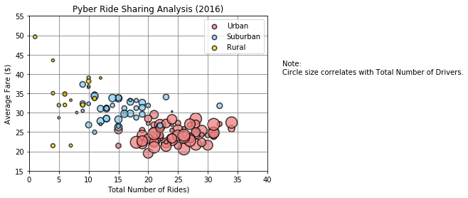
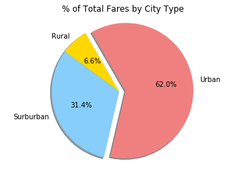
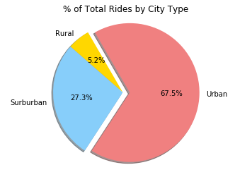
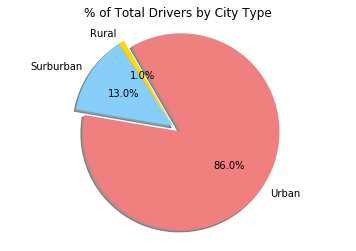

# Pyber Ride Sharing


# Analysis

### Observed Trend 1: 
Based on the data given, urban area tend to be the popular area where mostly visited by drivers and customers take rides quite often and so the average fares are relatively steady in between $20 ~ $30

### Observed Trend 2: 
There were few drivers who visited both urban and suburban area, but the drivers focus on rural area tend to have no willingness to visit the urban area, so does drivers focus on urban area who tend to never visited rual area as well

### Observed Trend 3: 
Based on the distance of every ride, average fares from rual area fluctuated in wide range


```python
# Dependencies
import pandas as pd
import numpy as np
import matplotlib.pyplot as plt
import seaborn as sns

# Setting the file path for clinical trial data file
city_data_file="city_data.csv"

# Setting the file path for mouse drug data file
ride_data_file="ride_data.csv"

# Reading the csv file
city_data_df=pd.read_csv(city_data_file)
ride_data_df=pd.read_csv(ride_data_file)

# Combining the data files to one single dataframe
combined_data=pd.merge(city_data_df,ride_data_df,on="city",how="left")

# Create data fram that grouped by city
group_by_city_df = combined_data.groupby(['city'])

# Calculate Average Fare ($) Per City
avg_fare = group_by_city_df['fare'].mean()

# Calculate Total Number of Rides Per City
ttl_num_of_rides = group_by_city_df['ride_id'].nunique()

# Calculate Total Number of Drivers Per City
ttl_num_of_drivers = group_by_city_df['driver_count'].max()

# Determine City Type 
city_type = group_by_city_df['type'].max()

# Create dataframe with results
summary_df = pd.DataFrame({'Average Fare ($)': avg_fare,
                          'Total Number of Rides': ttl_num_of_rides,
                          'Total Number of Drivers': ttl_num_of_drivers,
                          'City Type': city_type})
summary_df.head()
```


<div>
<style>
    .dataframe thead tr:only-child th {
        text-align: right;
    }

    .dataframe thead th {
        text-align: left;
    }

    .dataframe tbody tr th {
        vertical-align: top;
    }
</style>
<table border="1" class="dataframe">
  <thead>
    <tr style="text-align: right;">
      <th></th>
      <th>Average Fare ($)</th>
      <th>City Type</th>
      <th>Total Number of Drivers</th>
      <th>Total Number of Rides</th>
    </tr>
    <tr>
      <th>city</th>
      <th></th>
      <th></th>
      <th></th>
      <th></th>
    </tr>
  </thead>
  <tbody>
    <tr>
      <th>Alvarezhaven</th>
      <td>23.928710</td>
      <td>Urban</td>
      <td>21</td>
      <td>31</td>
    </tr>
    <tr>
      <th>Alyssaberg</th>
      <td>20.609615</td>
      <td>Urban</td>
      <td>67</td>
      <td>26</td>
    </tr>
    <tr>
      <th>Anitamouth</th>
      <td>37.315556</td>
      <td>Suburban</td>
      <td>16</td>
      <td>9</td>
    </tr>
    <tr>
      <th>Antoniomouth</th>
      <td>23.625000</td>
      <td>Urban</td>
      <td>21</td>
      <td>22</td>
    </tr>
    <tr>
      <th>Aprilchester</th>
      <td>21.981579</td>
      <td>Urban</td>
      <td>49</td>
      <td>19</td>
    </tr>
  </tbody>
</table>
</div>


#  Bubble Plot of Ride Sharing Data


```python
# Create filtered dataframe where City Type = Urban
urban_df = summary_df.loc[summary_df['City Type'] == 'Urban']

# Create filtered dataframe where City Type = Suburban
suburban_df = summary_df.loc[summary_df['City Type'] == 'Suburban']

# Create filtered dataframe where City Type = Rural
rural_df = summary_df.loc[summary_df['City Type'] == 'Rural']

urban_plot = plt.scatter(urban_df['Total Number of Rides'], urban_df['Average Fare ($)'], s = urban_df['Total Number of Drivers']*4, 
                         color='lightcoral', alpha=0.75, edgecolor='black', linewidths=1.5, 
                         label='Urban')

suburban_plot = plt.scatter(suburban_df['Total Number of Rides'], suburban_df['Average Fare ($)'], s = suburban_df['Total Number of Drivers']*4, 
                            color='lightskyblue', alpha=0.75, edgecolor='black',linewidths=1.5, 
                            label='Suburban')

rural_plot = plt.scatter(rural_df['Total Number of Rides'], rural_df['Average Fare ($)'], s = rural_df['Total Number of Drivers']*4, 
                         color='gold', alpha=0.75, edgecolor='black',linewidths=1.5, 
                         label='Rural')

# Add limits, title, x/y label, legend Grid and Note
plt.xlim(0, 40)
plt.ylim(15,55)

plt.title('Pyber Ride Sharing Analysis (2016)')
plt.xlabel('Total Number of Rides)')
plt.ylabel('Average Fare ($)')

lgnd = plt.legend(handles=[urban_plot,suburban_plot,rural_plot], loc ='upper right')
lgnd.legendHandles[0]._sizes = [40]
lgnd.legendHandles[1]._sizes = [40]
lgnd.legendHandles[2]._sizes = [40]

plt.grid(color="gray") 

plt.annotate("Note: \nCircle size correlates with Total Number of Drivers.", xy=(30, 40), xycoords='data',xytext=(42.5, 40),)

plt.show()
```





```python
# Create data fram that grouped by type
group_by_type_df = combined_data.groupby(['type'])

```

# % of Total Fares by City Type


```python
# Geneate x-asis for pie chart
ttl_fares = group_by_type_df["fare"].sum()

# Setup pie chart aesthetics 
labels = ["Rural", "Surburban", "Urban"]
colors = ["gold","lightskyblue", "lightcoral"]
explode = [0,0,.1]

# Tell matplotlib to create a bar chart based upon the above dat
plt.pie(ttl_fares, explode=explode, labels=labels, colors=colors, autopct= '%1.1f%%', shadow=True, startangle=120)

# Add title
plt.title('% of Total Fares by City Type')

plt.axis("equal")

# Display figure
plt.show()
```





# % of Total Rides by City Type


```python
# Geneate x-asis for pie chart
ttl_rides = group_by_type_df["ride_id"].count()

# Setup pie chart aesthetics 
labels = ["Rural", "Surburban", "Urban"]
colors = ["gold","lightskyblue", "lightcoral"]
explode = [0,0,.1]

# Tell matplotlib to create a bar chart based upon the above dat
plt.pie(ttl_rides, explode=explode, labels=labels, colors=colors, autopct= '%1.1f%%', shadow=True, startangle=120)

# Add title
plt.title('% of Total Rides by City Type')

plt.axis("equal")

# Display figure
plt.show()
```





# % of Total Drivers by City Type


```python
# Geneate x-asis for pie chart
ttl_drivers = group_by_type_df["driver_count"].sum()
ttl_drivers
```


    type
    Rural         727
    Suburban     9730
    Urban       64501
    Name: driver_count, dtype: int64


```python
# Geneate x-asis for pie chart
ttl_drivers = group_by_type_df["driver_count"].sum()

# Setup pie chart aesthetics 
labels = ["Rural", "Surburban", "Urban"]
colors = ["gold","lightskyblue", "lightcoral"]
explode = [0,0,.1]

# Tell matplotlib to create a bar chart based upon the above dat
plt.pie(ttl_drivers, explode=explode, labels=labels, colors=colors, autopct= '%1.1f%%', shadow=True, startangle=120)

# Add title
plt.title('% of Total Drivers by City Type')

plt.axis("equal")

# Display figure
plt.show()
```




